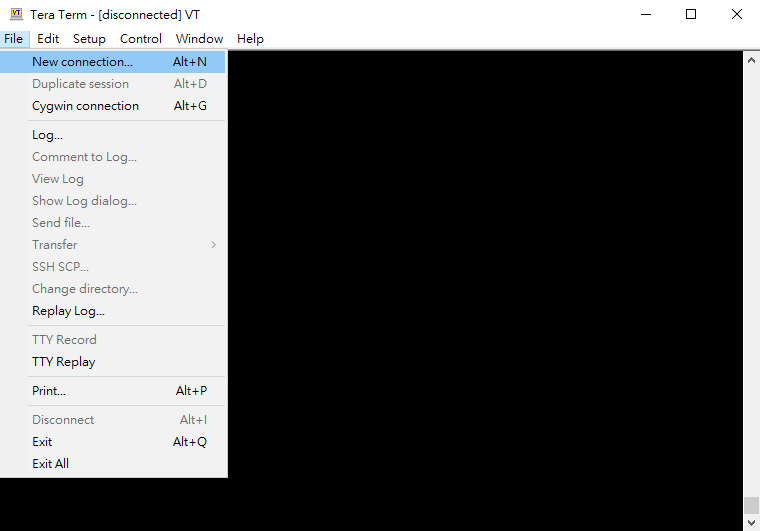

# Himax-AIoT-WF-G1 Platform EVB USER GUIDE

Himax-AIoT-WF-G1 Platform EVB includes Himax WE-I Plus MCU, image sensor and rich peripheral supports. The details are given in the following paragraph.


## Table of contents

- [Himax-AIoT-WF-G1 Platform EVB](#himax-aiot-wf-g1-platform-evb)
- [System Requirement](#system-requirement)
  - [Hardware Environment Setup](#system-requirement)
  - [Software Tools](#system-requirement)
- [Himax-AIoT-WF-G1 Platform EVB Startup](#himax-aiot-wf-g1-platform-evb-startup)
  - [Startup Flowchart](#startup-flowchart)
  - [Power ON EVB](#power-on-evb)
  - [Flash Image via OTA tool update](#flash-image-via-ota-tool-update)
  - [Check UART Message Output](#check-uart-message-output)
- [WIFI Network Setup](#wifi-network-setup)
- [Operators Network Setup](#operators-network-setup)
- [Connect Azure Device Provisioning Service(DPS) and IoTHub Device](#connect-azure-device-provisioning-servicedps-and-iothub-device)
- [Connect Azure IoT Central](#connect-azure-iot-central)
  - [Send Algorithm Metadata](#send-algorithm-metadata)
  - [Send Image](#send-image)
  - [Send Algorithm Metadata and Image](#send-algorithm-metadata-and-image)
  - [Send Custom JSON Format Data](#send-custom-json-format-data)
  - [Enter Power Saving Mode](#enter-power-saving-mode)
  - [Azure RTOS Startup](#azure-rtos-startup)
- [TensorFlow Lite for Microcontroller Example](#tensorflow-lite-for-microcontroller-example)
  - [TFLM Model Path](#tflm-model-path)
  - [TFLM Example Person Detection INT8](#tflm-example-person-detection-int8)
- [Model Deployment Tutorial](#model-deployment-tutorial)


## Himax-AIoT-WF-G1 Platform EVB


  1.	Himax WE-I Plus chip
  3.	HM0360 AoS<sup>TM</sup> VGA camera
  4.    Microphones (L/R) at back side
  5.	3-Axis Accelerometer
  6.	3-Axis Gyroscope
  7.	3-Axis Magnetometer
  8.	Reset Button
  9.	GREEN LED x2 and RED LEDx1 and BLUE LEDx1
  10.	Micro-USB cable (I2C/SPI/Flash Download)

  <a href="docs/HX6539-A_HWUG(WiFi-ESP12F)_preliminary.pdf" target="_blank">Hardware User Guide PDF</a>

## System Requirement
  - Hardware Environment Setup
    - Prepare Two Micro USB Cable: connect to EVB (as Power/UART)

  - Software Tools
    - OTA tool (Windows application, image flash)
    ```
      Tools can be found in Himax-AIoT-WF-G1-SDK-Azure-RTOS-main/himax_aiot_wf_g1-master/tools
    ```
    - Serial Terminal Emulation Application
      - In the following description, [TeraTerm](https://ttssh2.osdn.jp/index.html.en) and [Minicom](https://linux.die.net/man/1/minicom)
        will be used.

## Himax-AIoT-WF-G1 Platform EVB Startup
  - Use the following procedure to startup the Himax-AIoT-WF-G1 platform EVB.

### Startup Flowchart

  

### Power ON EVB
Power supply by usb or battery(AAA*4)

### Flash Image via OTA tool update
> All following steps are done in Windows.
  
- ***Step 1:*** Connect with PC USB to power on ***Himax-AIoT-WF-G1 Platform EVB***. 

- ***Step 2:*** Turn pin #1 switch on & press `Reset button` to reset.  
- 


- ***Step 3:*** Excute OTA.exe on `Himax-AIoT-WF-G1-SDK-Azure-RTOS-main/himax_aiot_wf_g1-master/tools/OTA_Tools/` and select <br><span style="color:red">3.Other Tools</span>.


  
- ***Step 4.1:*** Excute OTA.exe on `Himax-AIoT-WF-G1-SDK-Azure-RTOS-main/himax_aiot_wf_g1-master/tools/OTA_Tools/` and select <br><span style="color:red">1.Boot from I2C </span>.
- ***Step 4.2:*** Enter the input files path manually:<br>`BootUpFromI2C\HX6537-A09TDIG-1111K_QFN72_Debug\sign_formal_PA8530_EM9D_2nd_Bootloader.bin`.<br> 
  

  
Select 0.extit/back when sent file done.

- ***Step 5:*** Excute OTA.exe on `Himax-AIoT-WF-G1-SDK-Azure-RTOS-main/himax_aiot_wf_g1-master/tools/OTA_Tools/` and select <br><span style="color:red">2.Upgrade </span>.
  


- ***Step 6:*** Excute OTA.exe on `Himax-AIoT-WF-G1-SDK-Azure-RTOS-main/himax_aiot_wf_g1-master//tools/OTA_Tools/` and select <br><span style="color:red">1.FORCE UPGRADE </span>.


Flash Image via OTA tool done


### Check UART Message Output
  - Serial Terminal Emulation Application Setting

|   |  |
| :------------ |:---------------:|
| Baud Rate  | 115200 bps |
| Data | 8 bit |
| Parity  | none  |
| Stop  | 1 bit  |
| Flow control | none |

  The system will output the following message to the UART console. Please setup UART terminal tool setting as (115200/8/N/1).

  - Display Log Message
  In the example, we use TeraTerm to see the output message.

    - TeraTerm New Connection

    

    - TeraTerm Select COM Port

    

    - Connect IoTHub Log Message

    

    - Run Person Detect Algorithm Log Message

    

  You can use the [Azure IoTHub Explorer](https://docs.microsoft.com/en-us/azure/iot-pnp/howto-use-iot-explorer) tool to see your metadata.
  As following image is simple demonstrate.
  Note: model id:`dtmi:himax:weiplus;2`

  

## WIFI Network Setup
    - Define as follows value in Himax-AIoT-WF-G1-SDK-Azure-RTOS-main/himax_aiot_wf_g1-master/app/scenario_app/hx_aiot_wifi_g1/azure_iothub.c 
    - #define WIFI_SSD 		"SSID"
    - #define WIFI_PW  		"PASSWORD"

    - #define NTP_TIMEZONE	 "key in your contoury UTC"
    - Example taiwan utc time zone: 
    - #define NTP_TIMEZONE	 "8"
    
## Operators Network Setup
    - Define as follows value in Himax-AIoT-WF-G1-SDK-Azure-RTOS-main/himax_aiot_wf_g1-master/app/scenario_app/hx_aiot_wifi_g1/azure_iothub.c 
    - #define ENABLE_OPERATORS_NETWORK_SETUP
    -
    - Operators network setting in Himax-AIoT-WF-G1-SDK-Azure-RTOS-main/himax_aiot_wf_g1-master/external/nb_iot/type1sc/type1sc.h 
    - #define OPERATORS_LPWAN_TPYE		<"choose support LPWAN for your SIM Card">
    - #define OPERATORS_APN			<"choose support APN for your SIM Card">
    - #define OPERATORS_BAND		<"choose support BAND for your SIM Card">
    -
    - Himax-AIoT-WF-G1-SDK default operators network setting as follows:
    - #define OPERATORS_LPWAN_TPYE		LPWAN_CATM1
    - #define OPERATORS_APN			    "\"internet.iot\""
    - #define OPERATORS_BAND		    LPWAN_BAND3
    
##  Connect Azure Device Provisioning Service(DPS) and IoTHub Device
    - Define as follows value in Himax-AIoT-WF-G1-SDK-Azure-RTOS-main/himax_aiot_wf_g1-master/app/scenario_app/hx_aiot_wifi_g1/inc/azure_iothub.h 
    - #define AZURE_DPS_IOTHUB_STANDALONE_TEST 1
    - #define ENDPOINT                        "global.azure-devices-provisioning.net"
    - #define HOST_NAME                       "Key-in your HOST_NAME"
    - #define ID_SCOPE                        "Key-in your ID_SCOPE"
    - #define DEVICE_ID                       "Key-in your DEVICE_ID"
    - #define REGISTRATION_ID                 "Key-in your REGISTRATION_ID"
    - #define DEVICE_SYMMETRIC_KEY            "Key-in DEVICE_SYMMETRIC_KEY"

##  Connect Azure IoT Central
    - Define as follows value in Himax-AIoT-WF-G1-SDK-Azure-RTOS-main/himax_aiot_wf_g1-master/app/scenario_app/hx_aiot_wifi_g1/inc/azure_iothub.h 
    - #define AZURE_DPS_IOTHUB_STANDALONE_TEST 0
    - #define ENDPOINT                        "global.azure-devices-provisioning.net"
    - #define REGISTRATION_ID                 "Key-in your REGISTRATION_ID"
    - #define ID_SCOPE                        "Key-in your ID_SCOPE"
    - #define DEVICE_SYMMETRIC_KEY            "Key-in DEVICE_SYMMETRIC_KEY"
          
more information please reference the file:  
<a href="docs/himax_WEI_Azure_RTOS_Device_getStartedDoc.pdf" target="_blank">himax_WEI_Azure_RTOS_Device_getStartedDoc</a>
      
## Send Algorithm Metadata
    - Algorithm Metadata structure(sample)
    - humanPresence : 1(detect human) , 0(no human)
    - upper_body_bbox.x : bounding box x-axis for detected human.
    - upper_body_bbox.y : bounding box y-axis for detected human. 
    - upper_body_bbox.width : bounding box width for detected human.
    - upper_body_bbox.height : bounding box height for detected human.
    - Change [azure_active_event]  value  in void tflitemicro_start() at Himax-AIoT-WF-G1-SDK-Azure-RTOS-main/himax_aiot_wf_g1-master/app/scenario_app/hx_aiot_wifi_g1/hx_aiot_wifi_g1.c  
    - azure_active_event = ALGO_EVENT_SEND_RESULT_TO_CLOUD;
     
## Send Image
    - Change [azure_active_event] value in void tflitemicro_start() at Himax-AIoT-WF-G1-SDK-Azure-RTOS-main/himax_aiot_wf_g1-master/app/scenario_app/hx_aiot_wifi_g1/hx_aiot_wifi_g1.c  
    - azure_active_event = ALGO_EVENT_SEND_IMAGE_TO_CLOUD;

## Send Algorithm Metadata and Image
    - Change [azure_active_event] value in void tflitemicro_start() at Himax-AIoT-WF-G1-SDK-Azure-RTOS-main/himax_aiot_wf_g1-master/app/scenario_app/hx_aiot_wifi_g1/hx_aiot_wifi_g1.c  
    - azure_active_event = ALGO_EVENT_SEND_RESULT_AND_IMAGE;

## Send Custom JSON Format Data
    - You can send custom json format data to the cloud through send_cstm_data_to_cloud(unsigned char *databuf, int size, uint8_t send_type)
    - unsigned char *databuf: data buffer, data must be json format.
    - int size: data size.
    - uint8_t send_type : SEND_CSTM_JSON_DATA

## Enter Power Saving Mode
    - Himax-AIoT-WF-G1-SDK-Azure-RTOS-main/himax_aiot_wf_g1-master/app/scenario_app/hx_aiot_wifi_g1/azure_iothub.c 
    - #define ENABLE_PMU
## Azure RTOS Startup
  - More detail information please reference [here](https://github.com/azure-rtos)

## TensorFlow Lite for Microcontroller Example 

### TFLM Model Path
  - Put your training model in Himax-AIoT-WF-G1-SDK-Azure-RTOS-main/himax_aiot_wf_g1-master/app/scenario_app/hx_aiot_wifi_g1 folder
 
### TFLM Example Person Detection INT8

  To generate person detection example flash binary for Himax AIoT Platform EVB:
  1. Based on the flow of [person detection example](https://github.com/tensorflow/tensorflow/tree/master/tensorflow/lite/micro/examples/person_detection_experimental#person-detection-example) to generate flash image. 
  2. Download image binary to Himax-AIoT-WF-G1 EVB, detail steps can be found at [Flash Image via OTA tool update](#flash-image-via-ota-tool-update).
  3. Person detection example message will be shown on the terminal application. 

### Model Deployment Tutorial

<a href="docs/Model deployment tutorial of Himax_AIOT_WF_G1.pdf" target="_blank">Model Deployment Tutorial PDF</a>
 
